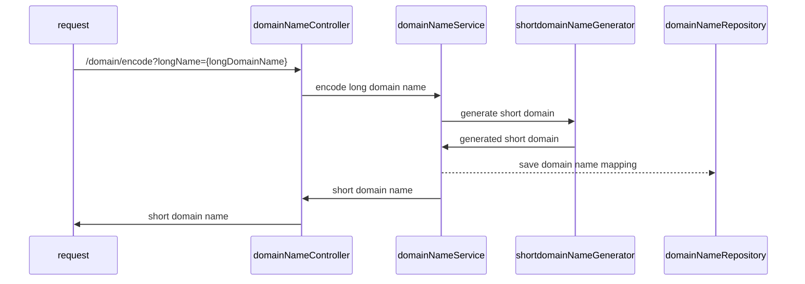
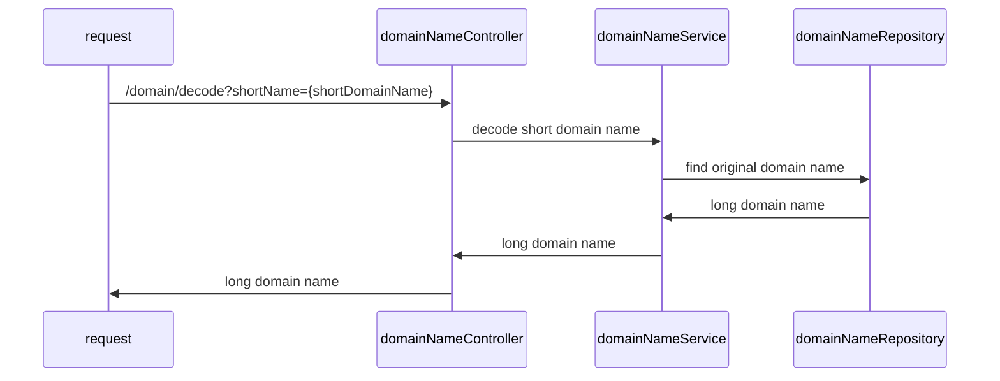

# Design Document
when we try to encode a long domain to a short domain name, we just return the short domain by concat pre-fix `t.cn/` and a generated base62 value.

The base62 value is converted from a 10dex value which is actually a token. We have a token generator which can control current assigned token, which start from 0 and will increase by 1 once we use it. The conversion logic between 10dex to 62dex is very easy, you can check the logic at `src/main/utils/NumberConverter`.

We save the mapping between encoded domain name and the original domain name in memory, which is underlying a concurrentHashMap for now. When we want to decode the short domain name back, we will look for the hashmap and check if there is such a record, if so, then return the original domain. If not, then return NOT_FOUND.

## Encode process

## Decode process

