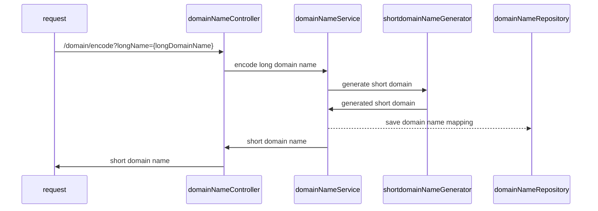
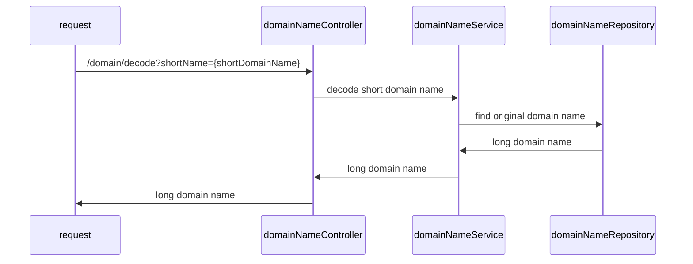

# Design Document
When we try to encode a long domain into a short domain, we just return the short domain by concat prefixing `t.cn/` and the resulting base62 value.

The base62 value is converted from the 10dex value which is actually a token. We have a token generator that controls the currently allocated tokens, it starts at 0 and increases by 1 each time. The conversion logic from 10dex to 62dex is very simple, you can view the logic in `src/main/utils/NumberConverter`.

We save the mapping between the encoded domain name and the original domain name in memory, which is currently implemented by concurrentHashMap. When we want to decode the short domain name back, we will look up the hashmap to check if there is such a record, and if so, return the original domain name. If not, return NOT_FOUND.

## Encode process

## Decode process

